<div align="center">

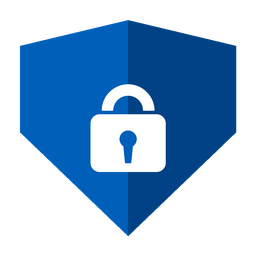

# Приватность Windows 11

**Отключает сбор данных Microsoft. Показывает, что о вас уже собрано.
Следит, чтобы обновления не вернули слежку обратно.**

[](https://github.com/N0deZ3r0/Win11Privacy/actions/workflows/build.yml)
[](https://github.com/N0deZ3r0/Win11Privacy/releases/latest)
[](LICENSE)


</div>

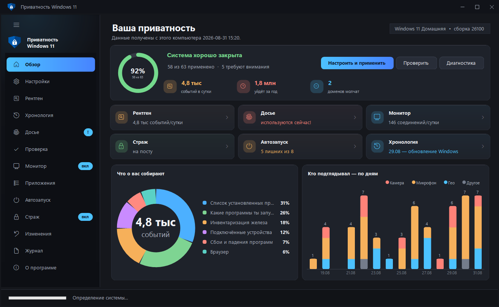

---

## Чего нет у других

| | |
|---|---|
| **Досье** | Кто и когда включал вашу камеру, микрофон и геолокацию — с длительностью и меткой «сейчас». Плюс цифровой след на диске: рекламный ID, история сетей Wi-Fi и флешек, история буфера обмена — с выборочным стиранием. |
| **Рентген телеметрии** | Читает настоящие события, которые Windows собрала об этом компьютере, и показывает их сырое содержимое — тот самый JSON, что уходит в Microsoft. |
| **Что о вас узнали** | Из этих событий вытаскиваются готовые факты: названия установленных программ, модель и серийные номера железа, подключённые устройства, метки, по которым вас узнают. Не «1420 событий», а что именно из них следует. |
| **Хронология приватности** | События телеметрии по дням, обновления Windows, правки программы и возвраты стража — на одной оси. Видно, как система отыгрывает настройки назад после очередного обновления. |
| **Проверка на деле** | Читает реальное состояние системы и считает индекс приватности, а не рисует галочки «сделано». |
| **Страж** | Крупные обновления Windows тихо возвращают часть настроек — страж проверяет систему по расписанию и возвращает сбитое. |
| **Слежение за датчиками** | Уведомление в тот момент, когда доступ к камере или микрофону впервые получила новая программа. |
| **Монитор утечек** | Кто и куда реально отправляет данные — по журналу брандмауэра, отдельно разрешённые соединения и отклонённые попытки. |
| **Машина времени** | Снимки состояния настроек и сравнение: что и когда сбилось. |
| **Отзыв доступа на месте** | Увидели, что программа включала камеру, — и запрещаете ей доступ кнопкой в той же строке. |
| **Удаление предустановленного** | Список приложений, которые Windows ставит без спроса, с пометкой «можно убрать». Системные компоненты в перечень не попадают. |
| **Запрет выхода в сеть** | Монитор показывает, кто и куда отправляет данные, — и кнопкой в той же строке программе закрывается выход в интернет. Правило создаётся в брандмауэре Windows и снимается тем же нажатием. |
| **Автозапуск под контролем** | Что стартует вместе с Windows — с ответом «зачем это здесь»: обновлятор, агент телеметрии, помощник производителя. Гасится обратимо, тем же способом, что и в диспетчере задач, и попадает в общий откат. |
| **Настройка по пунктам** | Модуль раскрывается в список отдельных настроек: можно применить не всё, а выбранное. |
| **Блокировка адресов** | Брандмауэр режет сами IP сбора данных — через `hosts` телеметрия уходит в обход. |
| **Предпросмотр изменений** | Кнопка «Что изменится» показывает список до применения: настройка, как сейчас, как станет. |
| **Возврат из копии** | Резервные копии реестра не просто складываются на диск — программа сама их находит и возвращает выбранную одним нажатием. |
| **Откат одной кнопкой** | Программа ведёт журнал изменений и возвращает каждый параметр в то значение, что было до неё. Ручной импорт .reg не нужен. |
| **Видно, что изменено** | Страница «Изменения» показывает каждую правку: что было, что стало и где это лежит. Любую строку можно вернуть отдельно, не откатывая остальное. |
| **Считает честно** | Индекс не занижается тем, что от программы не зависит: настройки, которых нет на этой версии Windows, и параметры, которые Windows не отдаёт даже администратору, показаны отдельно и в знаменатель не идут. |
| **Переносимый режим** | Положите рядом с `Win11Privacy.exe` файл `portable.txt` — и программа будет хранить всё в папке рядом с собой, а не в системе. Для флешки и чужого компьютера. |
| **Убирает и за собой** | Всё, что программа накопила о вас у себя — историю датчиков, журнал, снимки — видно на «О программе» и стирается одной кнопкой. |
| **Сессии трассировки ETW** | Windows запускает сборщики телеметрии при загрузке, помимо службы DiagTrack — программа выключает и их. |
| **Доказательство результата** | Не «индекс 92 %», а что было до программы и что стало: сборщики, задачи, домены, события в сутки. |
| **Все разрешения приложений** | 25 категорий — не только камера и микрофон, но и снимки экрана, уведомления, документы, весь диск. Видно и тех, кто разрешение имеет, но пока не пользовался. |

Ещё: готовые наборы «Базовый / Строгий / Максимум», телеметрия сторонних программ (Chrome, Edge, Office, VS Code, NVIDIA, PowerShell, Visual Studio),
слежка производителя ноутбука, блокировка через брандмауэр, стирание накопленного буфера телеметрии,
профили и тихий запуск из командной строки, диагностика, светлая и тёмная темы.

---

## Переносимый режим

Обычно программа держит свои данные в `C:\ProgramData\Win11Privacy`, а размер
окна и язык — в `%LOCALAPPDATA%`. Если положить рядом с `Win11Privacy.exe` файл
**`portable.txt`** (или один раз запустить `Win11Privacy.exe --portable`), всё
переедет в папку `Win11Privacy-Data` рядом с самой программой: журнал изменений,
история датчиков, снимки, резервные копии реестра и настройки окна. На чужом
компьютере после себя не остаётся ничего, кроме самих изменений в системе —
которые по-прежнему можно откатить.

---

## Windows 10

Программа работает и на Windows 10, но 12 настроек из набора относятся к тому,
чего там нет вовсе: Copilot, Recall, Click to Do, виджеты. Они помечены
минимальной версией Windows, не применяются и **не считаются в индексе** —
на «Проверке» видно плитку «Нет на этой Windows». Политики Edge, Блокнота и
Paint при этом работают на обеих версиях и применяются как обычно.

---

## Язык

Интерфейс полностью на русском и английском, включая названия всех 191 настройки
и HTML-отчёт.
Язык берётся из настроек Windows и переключается кнопкой на странице «О программе».

---

## Скачать и запустить

1. Возьмите `Win11Privacy.exe` из [релизов](https://github.com/N0deZ3r0/Win11Privacy/releases/latest).
2. Правый клик по файлу → **Свойства** → внизу галочка **«Разблокировать»** → ОК.
   Так убирается предупреждение SmartScreen — оно появляется у любого неподписанного приложения из интернета.
3. Запустите. Программа попросит права администратора: без них системные настройки не меняются.

Устанавливать ничего не нужно — приложение работает на встроенном в Windows .NET Framework 4.8,
а движок вшит внутрь exe.

> **Совет:** первым делом нажмите **«Проверить»** — увидите текущее состояние, ничего при этом не меняя.
> Резервная копия реестра и точка восстановления создаются автоматически перед применением.

---

## Как это выглядит

| Настройки — модуль раскрыт в отдельные пункты | Досье — кто включал камеру и микрофон |
|---|---|
| 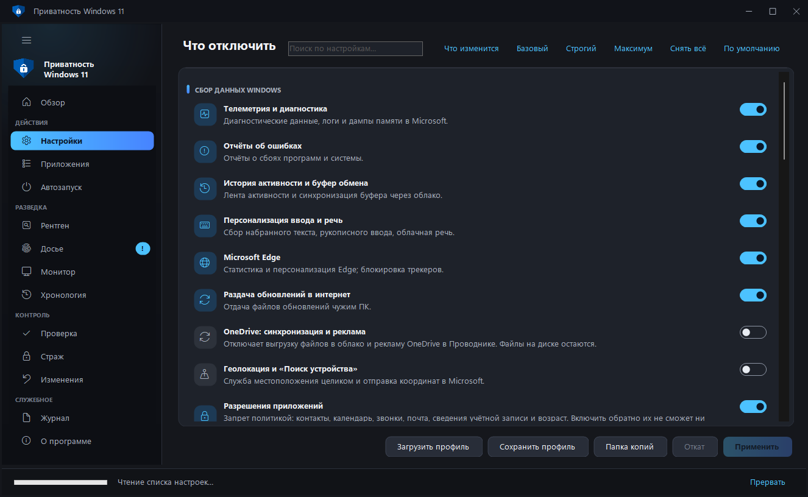 | 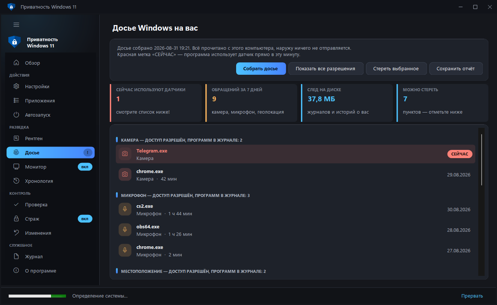 |

| Приложения — удаление предустановленного | Рентген телеметрии |
|---|---|
| 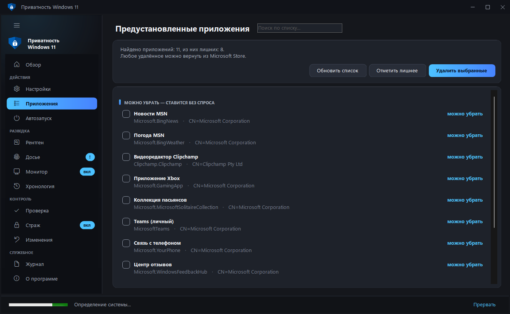 | 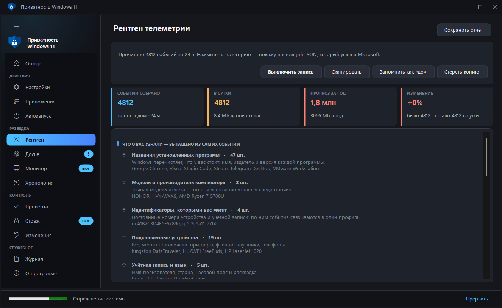 |

| Проверка — индекс, что не применено и чего нет на этой Windows |
|---|
| 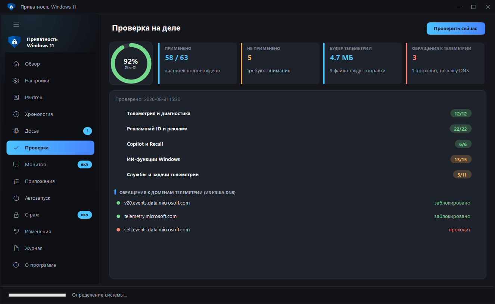 |

| Автозапуск — что стартует вместе с Windows | Монитор — кто отправляет и кому закрыт выход |
|---|---|
| 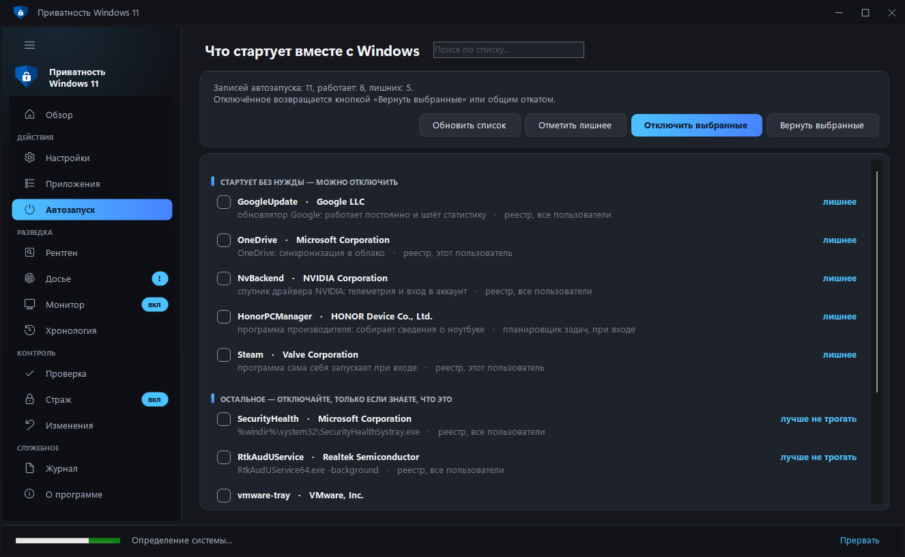 | 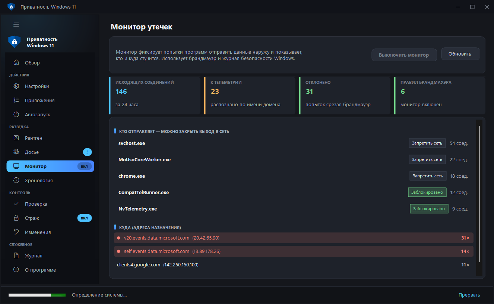 |

| Изменения — что программа поменяла и как вернуть | Хронология — телеметрия по дням и обновления Windows |
|---|---|
| 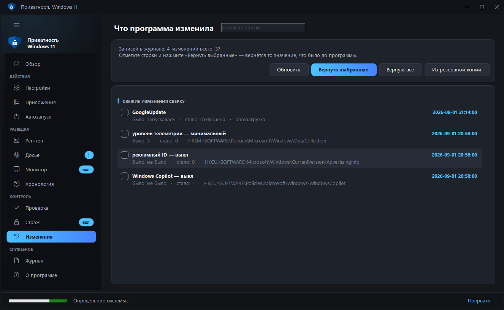 | 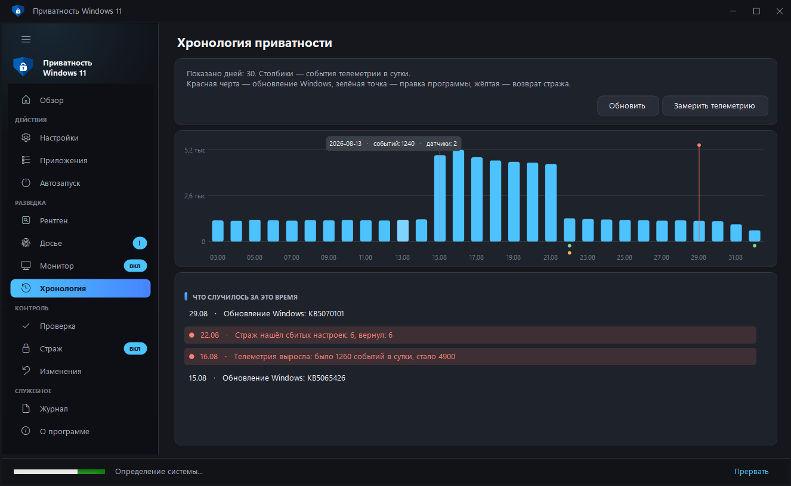 |


---

## Как собрать

Двойной клик по **`build.cmd`**. Через пару секунд рядом появится `Win11Privacy.exe`.

Если хочется вручную:

```
%WINDIR%\Microsoft.NET\Framework64\v4.0.30319\csc.exe /target:winexe /out:Win11Privacy.exe ^
  /reference:System.dll /reference:System.Core.dll /reference:System.Drawing.dll /reference:System.Windows.Forms.dll ^
  /win32res:app.res ^
  /resource:Win11-Privacy-Engine.ps1,engine.ps1 /resource:app.ico,app.ico /resource:app.png,app.png ^
  MainForm.cs Ui.cs Ui2.cs Ui3.cs Ui4.cs Lang.cs Json.cs
```

---

## Из чего состоит

| Файл | Что внутри |
|---|---|
| **Win11-Privacy-Engine.ps1** | Движок. Вся работа с системой: реестр, службы, задачи планировщика, hosts, брандмауэр, рентген телеметрии, досье (датчики и цифровой след), страж, снимки состояния, чистка. Вшивается в exe как ресурс `engine.ps1` и распаковывается во временную папку при запуске. Может работать и сам по себе. |
| **MainForm.cs** | Окно, тринадцать страниц, запуск движка, разбор его ответов, отчёт HTML, режим командной строки. |
| **Ui.cs** | Тема (цвета, шрифты), карточки, переключатели, кнопки, строки списков, кольцо индекса, плитки. |
| **Ui2.cs** | Заголовок окна, градиентная боковая панель, скользящая подсветка навигации, кольцевая диаграмма, плитки главного экрана, анимация значений. |
| **Ui3.cs** | Строки страницы «Досье»: кто включал камеру/микрофон (SpyRow), цифровой след с чекбоксами стирания (WipeRow), график датчиков по дням (SensorChart). |
| **Ui4.cs** | Адаптивная вёрстка: сетка плиток, подстраивающаяся под ширину окна (TileGrid), панель содержимого без мерцания. |
| **Lang.cs** | Английский перевод интерфейса. Собирается из `lang-en*.txt` командой `python tools/gen_lang.py` — правьте словари, а не сам Lang.cs. `python tools/check_lang.py` покажет строки, для которых перевода ещё нет. |
| **Json.cs** | Разбор JSON без внешних библиотек — движок отвечает строками `###JSON### {...}`. |
| **app.manifest** | Требование прав администратора, поддержка масштабирования экрана. |
| **app.res** | Готовый ресурс Win32: манифест + иконка (7 размеров) + версия. Пересобирать не нужно. |
| **app.ico / app.png** | Иконка приложения. |
| **tests/engine-tests.ps1** | Проверки поведения движка: их же гоняет сборка на GitHub. |
| **check-engine.cmd** | Самопроверка движка. Только чтение, ничего не меняет. |

---

## Как программа устроена

Интерфейс **ничего не делает сам**. Он собирает список выбранных модулей и
запускает движок:

```
powershell.exe -File engine.ps1 -Modules telemetry,ads,cleanup -BackupRoot "C:\...\Desktop"
```

Движок печатает ход работы построчно (интерфейс раскрашивает: `[+]` зелёным,
`[!]` красным) и в конце может выдать структурированный ответ строкой
`###JSON### {...}` — его разбирает `Json.cs` и рисует на страницах.

Благодаря этому движок полностью проверяем отдельно от интерфейса.

### Команды движка

| Команда | Что делает |
|---|---|
| `-Modules a,b,c` | применить выбранные модули |
| `-DryRun` | показать что было бы сделано, ничего не меняя |
| `-Detect` | определить систему, редакцию, установленные программы, слежку производителя |
| `-Audit` | прочитать реальное состояние всех настроек, вернуть индекс |
| `-XrayEnable` / `-XrayScan` / `-XrayWipe` | рентген телеметрии |
| `-Spy` | досье: кто и когда включал камеру, микрофон, геолокацию |
| `-Footprint` | досье: цифровой след на диске (рекламный ID, сети, флешки, истории) |
| `-FootprintWipe -WipeItems a,b` | стереть выбранные элементы следа |
| `-SensorSet -SensorKey k -SensorValue Deny` | запретить программе доступ к камере, микрофону или геолокации |
| `-Proof` / `-ProofSave` | доказательство результата: снимок «до» и сравнение с текущим |
| `-ListDefs` | список отдельных настроек внутри модулей |
| `-SkipItems a#1,b#2` | применить модуль, кроме указанных пунктов |
| `-ListApps` / `-RemoveApps -AppItems a,b` | предустановленные приложения: список и удаление |
| `-ListStartup` | автозагрузка: что стартует вместе с Windows |
| `-ChangeLog` / `-RestoreItems -ChangeItems a,b` | журнал изменений и возврат отдельных записей |
| `-DataInfo` / `-PurgeData` | что программа хранит о вас у себя и удаление этого |
| `-DataRoot "C:\...\Win11Privacy-Data"` | держать данные в указанной папке (переносимый режим) |
| `-Timeline -TimelineDays 30` | хронология: телеметрия по дням, обновления Windows, правки и возвраты |
| `-ListBackups` / `-RestoreBackup -BackupPath ...` | резервные копии реестра: список и возврат |
| `-CleanJunk` | убрать параметры, записанные версиями до 1.6 под числовыми именами |
| `-StartupSet -StartupItems a,b -StartupValue Off` | погасить или вернуть записи автозапуска |
| `-InstallSensorGuard` / `-RemoveSensorGuard` | слежение за датчиками: каждые 30 минут сверка журнала, уведомление о новой программе |
| `-SensorGuard` | одна проверка слежения (её запускает планировщик) |
| `-Monitor` / `-EnableMonitor` | статистика исходящих соединений |
| `-BlockApp -AppPath "C:\...\app.exe"` | запретить программе выход в сеть (`-UnblockApp` — вернуть) |
| `-Audit -WithProof` | проверка и доказательство результата одним прогоном |
| `-InstallGuard` / `-GuardNow` | страж, возвращающий сбитые настройки |
| `-Snapshot` / `-SnapshotDiff` | машина времени |
| `-InstallWatcher` | живые уведомления о перехвате |
| `-Revert` | откат всего |

### Как добавить новую настройку

Одна строка в движке, рядом с остальными:

```powershell
Def 'telemetry' 'reg' 'HKLM:\SOFTWARE\Policies\...' 'ИмяПараметра' 0 'DWord' 'человеческое описание'
```

`Def` описывает **что должно быть**, а не как это сделать. Из одного описания
работают сразу: применение, проверка, страж и снимки состояния. Поддерживаемые
типы: `reg`, `regif` (только если ключ уже есть), `regpol` (политика, которую
Windows может не отдать даже администратору — тогда это не ошибка), `svc`,
`svcopt`, `task`, `taskglob`, `env`, `vscode`, `firefox`, `hosts`, `fwsvc`,
`fwapp`.

Чтобы новый модуль появился в интерфейсе — добавьте строку в `BuildModules()`
в `MainForm.cs`.

---

## Проверка без сборки

**`check-engine.cmd`** запускает движок в режиме только чтения и складывает
рядом четыре файла с результатами: определение системы, проверка настроек,
статус рентгена и тестовый прогон. Ничего в системе не меняется.

---

## Что можно посмотреть в отладке

Интерфейс собирается с флагом `UITEST` — тогда окно открывается с тестовыми
данными и само закрывается через 13 секунд:

```
csc ... /define:UITEST ...
```

Переменные окружения `WIN11_TEST_PAGE` (какую страницу открыть) и
`WIN11_TEST_MOCK=1` (подставить тестовые данные). Ещё есть `BIGFONT` —
имитация экрана со 150% масштабом, и `LIGHTTEST` — светлая тема.

---

## Если вы пользовались версиями 1.1–1.5

В них была ошибка: счётчик внутри функции `Def` затирал имя параметра реестра
(в PowerShell `$n` и `$N` — одна переменная). Из-за этого настройки записывались
под числовыми именами — `0`, `1`, `2` вместо `AllowTelemetry` — и **ничего не
меняли**, а проверка показывала их применёнными, потому что читала то же
неверное имя.

Начиная с 1.6 имена восстановлены. Программа сама находит оставшийся мусор
(кнопка **«Убрать мусор»** на странице «Проверка» или `-CleanJunk`) и удаляет
только те числовые параметры, которые совпадают и по номеру, и по значению.
После обновления стоит один раз нажать «Проверить», а затем «Применить».

---

## Честно о пределах

Полностью прекратить обмен данными с Microsoft на Windows нельзя: остаются
проверка обновлений, активация лицензии и проверка сертификатов. На редакциях
Home и Pro минимальный уровень телеметрии система трактует как «Обязательные
данные» — это ограничение редакции, а не программы.

Программа не подписана сертификатом, поэтому Windows покажет предупреждение
SmartScreen при первом запуске скачанного файла: правый клик по файлу →
Свойства → галочка «Разблокировать». Запрос прав администратора остаётся —
он нужен, потому что программа меняет системные настройки.

---

## Сборка и релизы

Локально: двойной клик по **build.cmd** — рядом появится Win11Privacy.exe.

В репозитории настроена автосборка (GitHub Actions):

- на каждый коммит в main и каждый pull request — проверяется синтаксис движка,
  прогоняются проверки его поведения, сверяется перевод, все страницы интерфейса
  открываются на тестовых данных по-русски и по-английски, собирается exe и
  проверяется, что движок вшит внутрь и совпадает с исходником, а манифест
  запрашивает права администратора;
- на тег вида **v1.0.0** — собранный exe автоматически выкладывается в релиз.

Выпустить новую версию:


