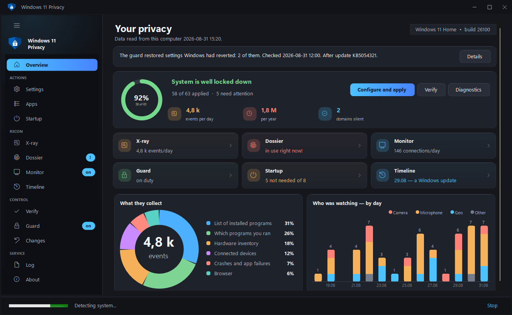
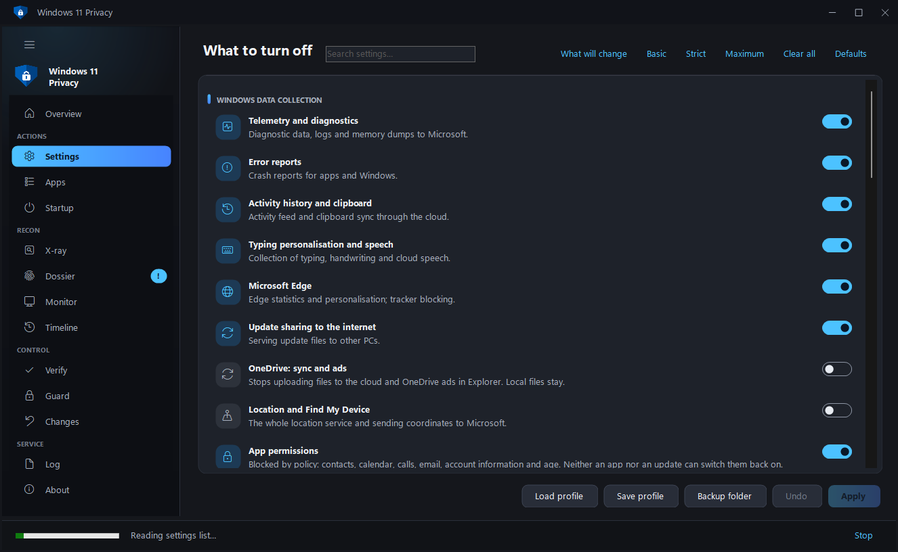
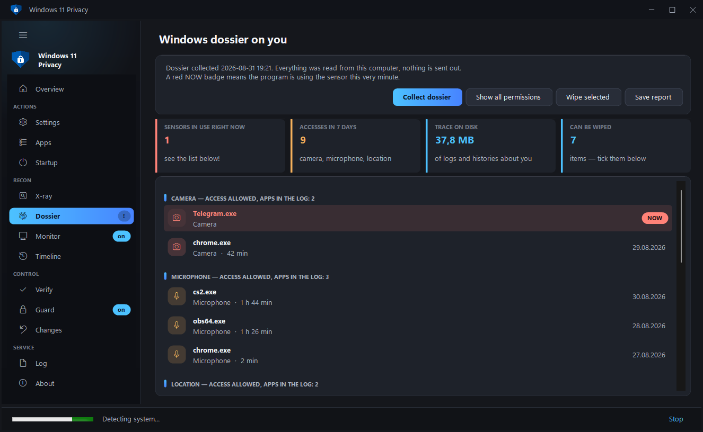
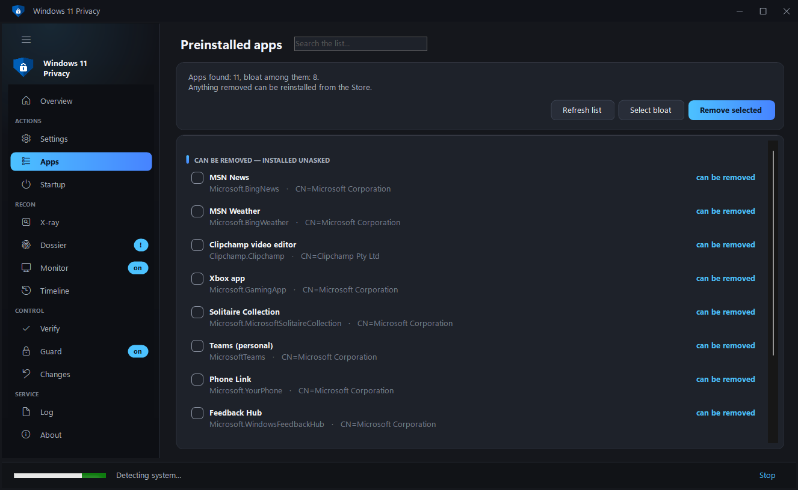
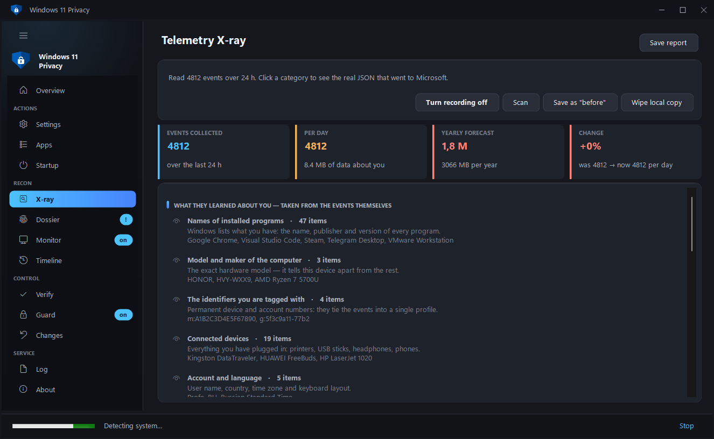
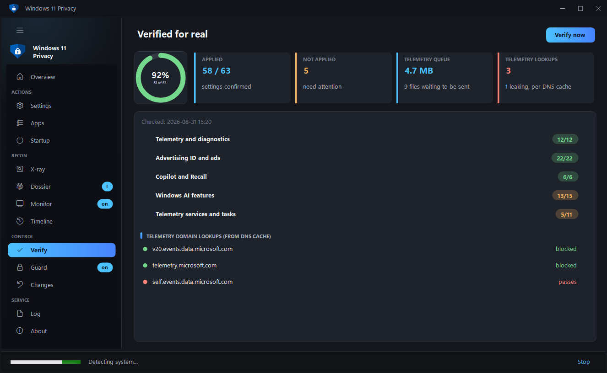
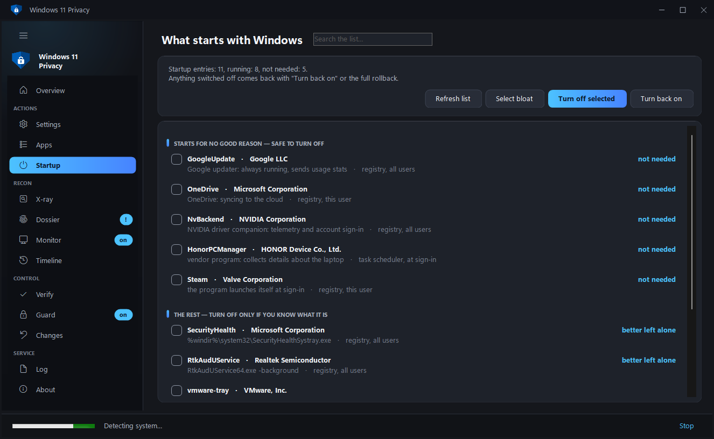
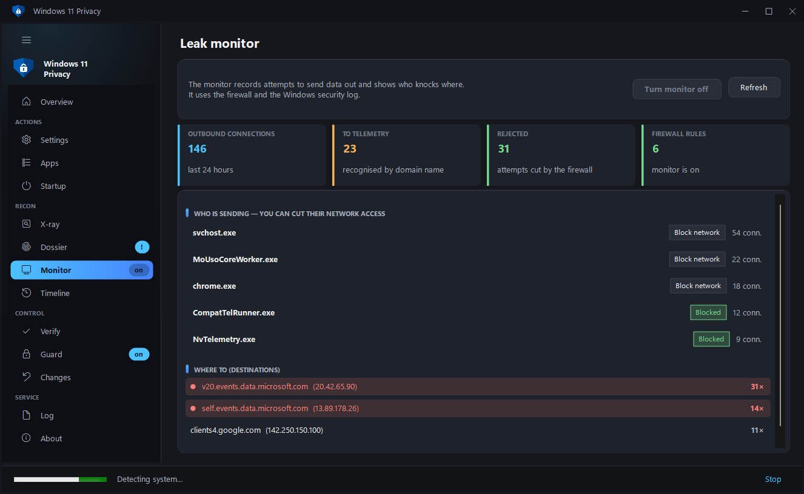
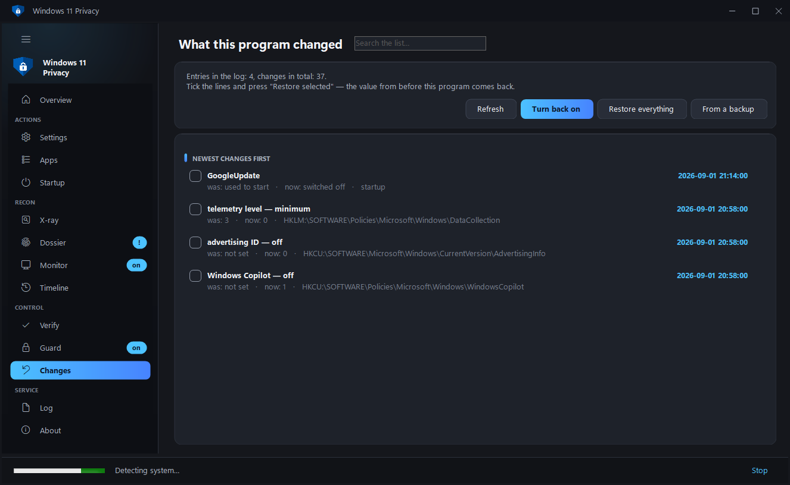
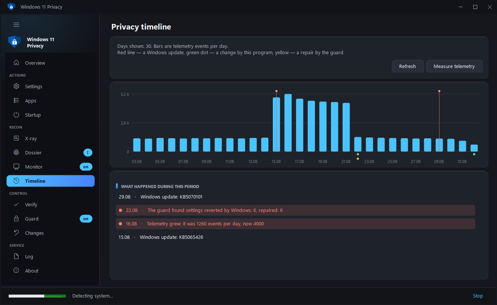

<div align="center">


# Win11Privacy

**Turns off Microsoft's data collection. Shows you what has already been collected
about you. Watches so that updates do not quietly turn the tracking back on.**

[](https://github.com/N0deZ3r0/Win11Privacy/actions/workflows/build.yml)
[](https://github.com/N0deZ3r0/Win11Privacy/releases/latest)
[](LICENSE)


**English** · [Русский](README.ru.md)

</div>



---

## What other tools do not have

| | |
|---|---|
| **Dossier** | Who turned on your camera, microphone and location, and when — with duration and a "right now" marker. Plus the digital trace left on disk: advertising ID, the history of Wi-Fi networks and USB sticks, clipboard history — each erasable on its own. |
| **Telemetry X-ray** | Reads the actual events Windows has collected about this computer and shows their raw contents — the very JSON that goes to Microsoft. |
| **What they learned about you** | Those events are turned into plain facts: names of installed programs, hardware model and serial numbers, connected devices, the markers you are recognised by. Not "1,420 events", but what follows from them. |
| **Privacy timeline** | Telemetry events by day, Windows updates, the program's own changes and the guard's reversions — on one axis. You can see the system rolling settings back after an update. |
| **Verification in practice** | Reads the real state of the system and computes a privacy index, instead of drawing "done" ticks. |
| **The guard** | Major Windows updates quietly restore some settings — the guard checks the system on a schedule and puts back what was knocked out. |
| **Sensor watch** | A notification at the moment a new program gains access to the camera or microphone for the first time. |
| **Leak monitor** | Who is actually sending data and where, from the firewall log — allowed connections and rejected attempts shown separately. |
| **Time machine** | Snapshots of the settings state, and a comparison: what drifted, and when. |
| **Revoke access in place** | You saw a program using the camera — you deny it access with a button on the same row. |
| **Removing preinstalled apps** | The list of apps Windows installs without asking, marked with what is safe to remove. System components do not appear in it. |
| **Block internet access** | The monitor shows who is sending data where — and a button on the same row cuts that program off from the network. The rule is created in Windows Firewall and removed by the same click. |
| **Startup under control** | What starts with Windows, with an answer to "why is this here": an updater, a telemetry agent, a vendor's helper. Disabled reversibly, the same way Task Manager does it, and included in the general rollback. |
| **Setting-by-setting control** | A module expands into a list of individual settings: you can apply some of them rather than all. |
| **Address blocking** | The firewall cuts off the data-collection IPs themselves — through `hosts` alone telemetry simply goes around. |
| **Preview of changes** | The "What will change" button shows the list before applying: the setting, how it is now, how it will be. |
| **Restore from a backup** | Registry backups are not merely dropped on disk — the program finds them itself and restores the one you pick with a single click. |
| **Rollback in one button** | The program keeps a change log and returns every parameter to the value it had before. No manual `.reg` import needed. |
| **You can see what was changed** | The "Changes" page shows every edit: what it was, what it became, and where it lives. Any row can be reverted on its own, without rolling back the rest. |
| **Counts honestly** | The index is not dragged down by things outside the program's control: settings that do not exist on this Windows version, and parameters Windows will not hand over even to an administrator, are shown separately and left out of the denominator. |
| **Portable mode** | Put a `portable.txt` file next to `Win11Privacy.exe` and the program keeps everything in a folder beside itself rather than in the system. For a USB stick, or someone else's computer. |
| **Cleans up after itself** | Everything the program has accumulated about you — sensor history, log, snapshots — is visible on the "About" page and erased with one button. |
| **ETW trace sessions** | Windows starts telemetry collectors at boot beyond the DiagTrack service — the program switches those off too. |
| **Proof of the result** | Not "index 92%", but what it was before the program and what it is now: collectors, tasks, domains, events per day. |
| **All app permissions** | 34 categories — not only camera and microphone, but screenshots, notifications, documents, the whole disk, passkeys and Windows AI models. Including apps that hold a permission but have not used it yet. |
| **Permissions by policy, not by switch** | Contacts, calendar, calls, email and account information are closed by policy: neither an app nor a Windows update can switch them back on. Age is part of it — the new Windows Age APIs give an app nothing without this permission. |
| **Background network calls** | Device metadata, on-demand fonts, offline maps, disk-health and speech models, Teredo — what Windows downloads and sends by itself. Taken from Microsoft's own list, safe items only. |
| **Windows logs in the digital trace** | Thousands of entries about which programs ran and what they accessed — shown in the Dossier and wiped along with the rest of the trace. |
| **One question on first run** | Instead of thirteen sections at once — "basic privacy", "strict", or "first show me what has been collected about me". The wizard applies nothing: it ticks a set and shows what will be done. |
| **Long work is visible and can be stopped** | A "Stop" button in the status bar. Reading stops at once, applying stops after a warning — everything the engine already changed is in the journal and can be reverted on the Changes page. Closing the window mid-run asks as well, instead of leaving the engine running unseen. |
| **The undo journal is written as it goes** | It used to be saved once, at the very end: an interrupted run left the changes in the system with nothing to revert them with. Now it hits the disk after every module and at least once every ten edits. |
| **The engine lives where nothing writes without administrator rights** | The script runs with full rights, so in the user's temp folder any process could have swapped it. The folder in ProgramData is created with explicit permissions, and before every launch the file is checked against the SHA-256 of what is embedded in the exe. |
| **A clear error instead of the .NET dialog** | When the program trips over something, it explains what happened and writes `crash.log` you can attach to a bug report. |
| **The guard comes right after an update** | A Windows update is what knocks the settings out, and a schedule could wait until Sunday. The guard now has a third alarm — the update installation itself: it checks the system five minutes later. |
| **One copy of the program** | A second launch brings up the window that is already open. Two windows with administrator rights would apply settings at the same time and overwrite each other's undo journal. |
| **You can see how far the check has got** | Verifying 244 settings takes up to half a minute and used to stay silent until the very end. Now the engine reports its progress and the window shows "15 / 34" and the name of the current section. |
| **The run log can be saved to a file** | A button on the Log page: these logs are what "it applied the wrong thing" cases are settled by, and a screenshot is no longer needed. |
| **Keyboard and screen reader** | Tab walks the sections, Enter and Space open the selected one, and the hand-drawn controls now tell the system their names — the reader used to read emptiness. |

Also: ready-made **Basic / Strict / Maximum** presets, third-party telemetry
(Chrome, Edge, Office, VS Code, NVIDIA, PowerShell, Visual Studio), laptop-vendor
tracking, firewall blocking, wiping the accumulated telemetry buffer, profiles and
silent launch from the command line (a profile remembers individual items inside
modules too), an update check on a button — the program never goes online by
itself, diagnostics, light and dark themes.

---

## Portable mode

Normally the program keeps its data in `C:\ProgramData\Win11Privacy`, and the
window size and language in `%LOCALAPPDATA%`. Put a **`portable.txt`** file next to
`Win11Privacy.exe` (or run `Win11Privacy.exe --portable` once) and all of it moves
into a `Win11Privacy-Data` folder beside the program itself: the change log, sensor
history, snapshots, registry backups and window settings. On someone else's
computer nothing is left behind except the system changes themselves — which can
still be rolled back.

---

## Windows 10

The program works on Windows 10 too, but 12 settings in the set relate to things
that do not exist there at all: Copilot, Recall, Click to Do, widgets. They are
marked with a minimum Windows version, are not applied and **do not count towards
the index** — the Audit page shows a "Not present on this Windows" tile. The Edge,
Notepad and Paint policies work on both versions and are applied as usual.

---

## Language

The interface is fully available in Russian and English, including the names of
all 244 settings and the HTML report. The language is taken from your Windows
settings and can be switched with a button on the "About" page.

---

## Download and run

1. Take `Win11Privacy.exe` from [Releases](https://github.com/N0deZ3r0/Win11Privacy/releases/latest).
2. Right-click the file → **Properties** → tick **Unblock** at the bottom → OK.
   That removes the SmartScreen warning, which appears for any unsigned
   application downloaded from the internet.
3. Run it. The program will ask for administrator rights: without them system
   settings cannot be changed.

Nothing needs installing — the application runs on the .NET Framework 4.8 built
into Windows, and the engine is embedded inside the exe.

> **Tip:** press **Audit** first — you will see the current state without changing
> anything. A registry backup and a restore point are created automatically before
> anything is applied.

---

## What it looks like

| Settings — a module expanded into individual items | Dossier — who turned on the camera and microphone |
|---|---|
|  |  |

| Apps — removing preinstalled software | Telemetry X-ray |
|---|---|
|  |  |

| Audit — the index, what was not applied, and what does not exist on this Windows |
|---|
|  |

| Startup — what launches with Windows | Monitor — who is sending, and who is cut off |
|---|---|
|  |  |

| Changes — what the program altered and how to undo it | Timeline — telemetry by day and Windows updates |
|---|---|
|  |  |

---

## How to build

Double-click **`build.cmd`**. A couple of seconds later `Win11Privacy.exe` appears
next to it.

By hand, if you prefer:

```
%WINDIR%\Microsoft.NET\Framework64\v4.0.30319\csc.exe /target:winexe /out:Win11Privacy.exe ^
  /reference:System.dll /reference:System.Core.dll /reference:System.Drawing.dll /reference:System.Windows.Forms.dll ^
  /win32res:app.res ^
  /resource:Win11-Privacy-Engine.ps1,engine.ps1 /resource:app.ico,app.ico /resource:app.png,app.png ^
  *.cs
```

---

## What it is made of

| File | What is inside |
|---|---|
| **Win11-Privacy-Engine.ps1** | The engine. All the work with the system: registry, services, scheduled tasks, hosts, firewall, telemetry X-ray, dossier (sensors and digital trace), the guard, state snapshots, cleanup. Embedded in the exe as the `engine.ps1` resource; before a launch it is placed in `C:\ProgramData\Win11Privacy\bin` — a folder nothing writes to without administrator rights. Can also run on its own. |
| **MainForm.cs** | The window frame: sidebar with groups, pages, launching the engine and parsing its replies, command-line mode. |
| **PageHome.cs / PageXray.cs / PageDossier.cs** | The "Overview", "X-ray" and "Dossier" pages — the largest of the thirteen. |
| **Actions.cs** | What each button does: applying, verifying, the monitor, the guard. |
| **Report.cs** | The "before and after" HTML report. |
| **Engine.cs** | Unpacking the engine: a folder writable by administrators only, and a SHA-256 check against what is embedded in the exe. |
| **Crash.cs** | Catching unhandled errors: a clear window instead of the system one, plus `crash.log`. |
| **AppInfo.cs** | The program version and the update check on GitHub — on a button only. |
| **Welcome.cs** | The first-run window: one question instead of thirteen sections at once. |
| **Mocks.cs** | Test data for interface screenshots, entirely under `#if UITEST`. |
| **SingleInstance.cs** | One copy of the program: a second launch shows the window that is already open. |
| **SelfTest.cs** | Checks for the pure functions of the interface — version comparison, parsing the engine's replies, "does this command change the system or only read it". A separate build under `#if SELFTEST`. |
| **Ui.cs** | Theme (colours, fonts), cards, switches, buttons, list rows, the index ring, tiles. |
| **Ui2.cs** | Window title bar, gradient sidebar, sliding navigation highlight, ring chart, home-screen tiles, value animation. |
| **Ui3.cs** | Rows of the "Dossier" page: who turned on the camera/microphone (`SpyRow`), the digital trace with erase checkboxes (`WipeRow`), the per-day sensor chart (`SensorChart`). |
| **Ui4.cs** | Adaptive layout: a tile grid that adjusts to the window width (`TileGrid`), a flicker-free content panel. |
| **Lang.cs** | The English translation of the interface. Generated from `lang-en*.txt` by `python tools/gen_lang.py` — edit the dictionaries, not `Lang.cs` itself. `python tools/check_lang.py` lists strings that have no translation yet. |
| **Json.cs** | JSON parsing without external libraries — the engine replies with `###JSON### {...}` lines. |
| **app.manifest** | The administrator-rights requirement and display-scaling support. |
| **app.res** | A prebuilt Win32 resource: manifest + icon (7 sizes) + version. No need to rebuild it. |
| **app.ico / app.png** | The application icon. |
| **tests/engine-tests.ps1** | Behaviour checks for the engine; the GitHub build runs the same ones. Read-only. |
| **tests/roundtrip.ps1** | Apply, verify and revert for real, then compare every value with the original one. It changes the system, so it needs the `-Confirmed` switch; the build runs it on a disposable machine. |
| **tools/make_winget.py** | Builds the winget catalogue manifest from the version and the release checksum. |
| **tools/set_version.py** | Writes the program version into `app.res` — the one Windows shows in the file properties. `--check` compares them, and the build insists on it. |
| **tools/submit_winget.py** | Submits the manifest of a new version to the winget catalogue: creates a branch in the fork, uploads the files and opens a pull request. The catalogue itself is never cloned — it weighs gigabytes. |
| **check-engine.cmd** | Engine self-check. Read-only, changes nothing. |

---

## How the program is built

The interface **does nothing itself**. It assembles a list of the selected modules
and launches the engine:

```
powershell.exe -File engine.ps1 -Modules telemetry,ads,cleanup -BackupRoot "C:\...\Desktop"
```

The engine prints its progress line by line (the interface colours it: `[+]` green,
`[!]` red) and at the end may return a structured reply as a `###JSON### {...}`
line — which `Json.cs` parses and draws on the pages.

Because of that the engine is fully testable separately from the interface.

### Engine commands

| Command | What it does |
|---|---|
| `-Modules a,b,c` | apply the selected modules |
| `-DryRun` | show what would be done, changing nothing |
| `-Detect` | identify the system, edition, installed programs, vendor tracking |
| `-Audit` | read the real state of every setting, return the index |
| `-XrayEnable` / `-XrayScan` / `-XrayWipe` | telemetry X-ray |
| `-Spy` | dossier: who turned on the camera, microphone, location, and when |
| `-Footprint` | dossier: the digital trace on disk (advertising ID, networks, USB sticks, histories) |
| `-FootprintWipe -WipeItems a,b` | erase the selected trace items |
| `-SensorSet -SensorKey k -SensorValue Deny` | deny a program access to the camera, microphone or location |
| `-Proof` / `-ProofSave` | proof of the result: a "before" snapshot and a comparison with the present |
| `-ListDefs` | list the individual settings inside the modules |
| `-SkipItems a#1,b#2` | apply a module except for the listed items |
| `-ListApps` / `-RemoveApps -AppItems a,b` | preinstalled apps: list and removal |
| `-ListStartup` | startup: what launches with Windows |
| `-ChangeLog` / `-RestoreItems -ChangeItems a,b` | the change log and reverting individual entries |
| `-DataInfo` / `-PurgeData` | what the program stores about you, and deleting it |
| `-DataRoot "C:\...\Win11Privacy-Data"` | keep the data in the given folder (portable mode) |
| `-Timeline -TimelineDays 30` | timeline: telemetry by day, Windows updates, edits and reversions |
| `-ListBackups` / `-RestoreBackup -BackupPath ...` | registry backups: list and restore |
| `-CleanJunk` | remove parameters written under numeric names by versions before 1.6 |
| `-StartupSet -StartupItems a,b -StartupValue Off` | disable or restore startup entries |
| `-InstallSensorGuard` / `-RemoveSensorGuard` | sensor watch: check the log every 30 minutes, notify about a new program |
| `-SensorGuard` | a single watch check (run by the scheduler) |
| `-Monitor` / `-EnableMonitor` | statistics of outbound connections |
| `-BlockApp -AppPath "C:\...\app.exe"` | deny a program network access (`-UnblockApp` to restore it) |
| `-Audit -WithProof` | audit and proof of the result in one run |
| `-InstallGuard` / `-GuardNow` | the guard that restores settings knocked out of place |
| `-Snapshot` / `-SnapshotDiff` | the time machine |
| `-InstallWatcher` / `-RemoveWatcher` | live notifications about interception |
| `-SelfTest` | engine self-check — the same "Diagnostics" as in the window |
| `-RestoreAll` | restore every journal entry and touch nothing else |
| `-PurgeBuffer` | wipe the telemetry that has not been sent yet |
| `-XrayStatus` / `-XrayDisable` / `-XrayBaseline` | recording status, switching it off, the "before" measurement |
| `-Revert` | roll everything back |

Qualifying switches: `-NoBackup` and `-NoRestorePoint` (skip the registry backup
and the restore point), `-GuardDaily` (the guard runs daily instead of weekly),
`-AllUsers` (remove apps for every user), `-SpyAll` (also show permissions never
used), `-MonitorHours`, `-XrayHours`, `-XrayMax`, `-TimelineDays` (how far back
to look and how much to take).

### How to add a new setting

One line in the engine, next to the others:

```powershell
Def 'telemetry' 'reg' 'HKLM:\SOFTWARE\Policies\...' 'ParameterName' 0 'DWord' 'human-readable description'
```

`Def` describes **what should be**, not how to achieve it. From a single
description you get applying, auditing, the guard and state snapshots at once.
Supported types: `reg`, `regif` (only if the key already exists), `regpol` (a
policy Windows may withhold even from an administrator — in which case that is not
an error), `svc`, `svcopt`, `task`, `taskglob`, `env`, `vscode`, `firefox`,
`hosts`, `fwsvc`, `fwapp`.

To make a new module appear in the interface, add a line to `BuildModules()` in
`MainForm.cs`.

---

## Checking without building

The undo is verified separately — for real, by applying and reverting:

```
powershell -ExecutionPolicy Bypass -File tests\roundtrip.ps1 -Confirmed
```

The test changes the settings of the computer, so without `-Confirmed` it refuses
to run. It applies the modules, makes sure the audit sees that, reverts and
compares **every** value with the one from before: comparing only the totals would
not be enough — errors cancelling each other out would go unnoticed.

**`check-engine.cmd`** runs the engine in read-only mode and leaves four result
files next to it: system detection, the settings audit, X-ray status and a test
run. Nothing in the system is changed.

---

## What you can inspect while debugging

The interface can be built with the `UITEST` flag — the window then opens with test
data and closes itself after 13 seconds:

```
csc ... /define:UITEST ...
```

Environment variables: `WIN11_TEST_PAGE` (which page to open),
`WIN11_TEST_MOCK=1` (substitute test data), `WIN11_TEST_EN=1` (English
interface), `WIN11_TEST_SHOT=path.png` (capture the window and exit),
`WIN11_TEST_WELCOME=1` (show the first-run window), `WIN11_TEST_UPDATE=1`
(press "Check for update"), `WIN11_TEST_DUMP=1` (print the control tree with
"ВЫЛЕЗ" and "ОБРЕЗАНО" markers). There are also the build flags `BIGFONT`,
which simulates a display at 150% scaling, and `LIGHTTEST` for the light theme.

The checks for the interface's pure functions build as a separate exe:

```
csc /define:SELFTEST /main:Win11Privacy.SelfTest ... *.cs
```

---

## If you used versions 1.1–1.5

They had a bug: a counter inside the `Def` function overwrote the registry
parameter name (in PowerShell `$n` and `$N` are the same variable). Because of
that, settings were written under numeric names — `0`, `1`, `2` instead of
`AllowTelemetry` — and **changed nothing**, while the audit reported them as
applied, because it read the same wrong name.

From 1.6 onwards the names are restored. The program finds the leftover junk
itself (the **Clean junk** button on the Audit page, or `-CleanJunk`) and deletes
only those numeric parameters that match both by number and by value. After
updating it is worth pressing Audit once, then Apply.

---

## Honest about the limits

You cannot completely stop data exchange with Microsoft on Windows: update checks,
licence activation and certificate validation remain. On the Home and Pro editions
the system treats the minimum telemetry level as "Required data" — that is a
limitation of the edition, not of this program.

The program is not signed with a certificate, so Windows will show a SmartScreen
warning the first time you run the downloaded file: right-click the file →
Properties → tick "Unblock". The administrator-rights prompt stays — it is needed
because the program changes system settings.

---

## Building and releases

Locally: double-click **build.cmd** — `Win11Privacy.exe` appears next to it.

The repository has automated builds (GitHub Actions):

- on every commit to `main` and every pull request — the engine's syntax is
  checked, the engine, interface and resource versions are compared, its behaviour
  tests and the interface's own checks are run, the translation is verified, **the settings are applied and reverted on a
  live disposable machine and every value is compared with what it was before**,
  every page of the interface and the first-run window are opened with test data in
  Russian and English, the exe is built, and it is confirmed that the engine is
  embedded inside it and matches the source, and that the manifest requests
  administrator rights;
- on a tag of the form **v1.0.0** — the tag is checked against the version inside
  the program, the built exe is published to a release together with the checksums
  and the winget manifest, and the manifest itself is submitted to the catalogue
  as a pull request.

Submitting to the catalogue is enabled by the repository secret **`WINGET_TOKEN`** —
a personal token with the `public_repo` scope: the build's built-in token cannot
write to someone else's repository. Without the secret the step is quietly skipped,
and the manifest can be sent by hand:

```
python tools/submit_winget.py
```

The contributor agreement (CLA) is signed once, and the fork of the catalogue is
created automatically.

To cut a new version:

1. Raise the number in two places — `AppInfo.cs` (`Version`) and the engine
   (`$script:EngineVersion`) — then write it into the version resource, the one
   Windows shows in the file properties:

   ```bash
   python tools/set_version.py
   ```

2. Commit the changes to `main`. The build checks the engine and the interface,
   verifies the translation and makes sure all three versions agree.
3. Create a tag with the same version and push it:

   ```bash
   git tag -a v1.9.3 -m "a line about what changed"
   git push origin v1.9.3
   ```

4. The rest happens on its own: the build compares the tag with the version
   inside the program, applies and reverts the settings on a disposable machine,
   creates the release with `Win11Privacy.exe`, `Win11-Privacy-Engine.ps1`,
   `SHA256SUMS.txt` and `winget-manifest.zip`, and then submits the manifest to
   the winget catalogue as a pull request.

If the tag and the version inside the program disagree, the build stops — a
release with the wrong number never goes out.

---

## Contributing

Bug reports and pull requests are welcome — see [CONTRIBUTING.md](CONTRIBUTING.md).
Found a security problem? [Report it privately](https://github.com/N0deZ3r0/Win11Privacy/security/advisories/new)
rather than in a public issue.

## License

[MIT](LICENSE).
